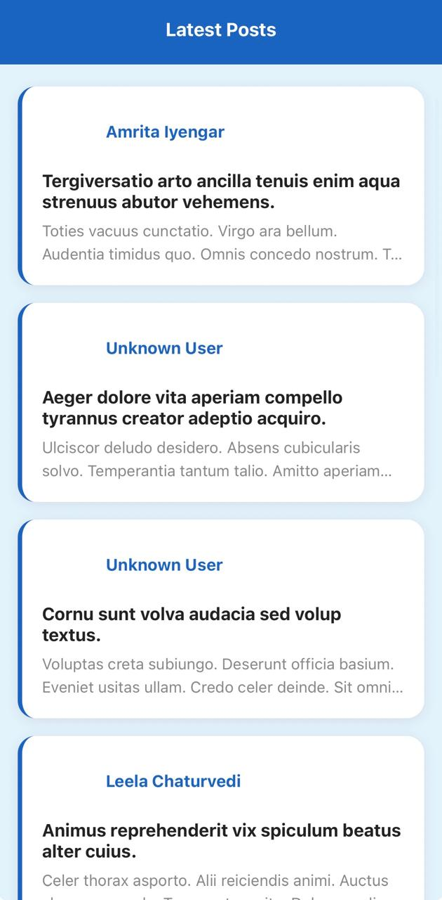
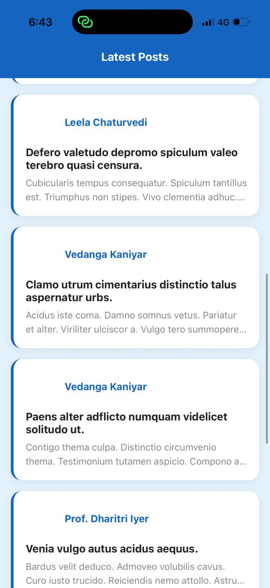
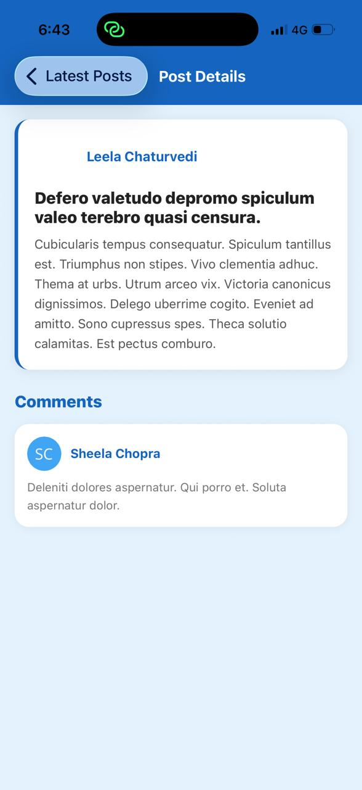
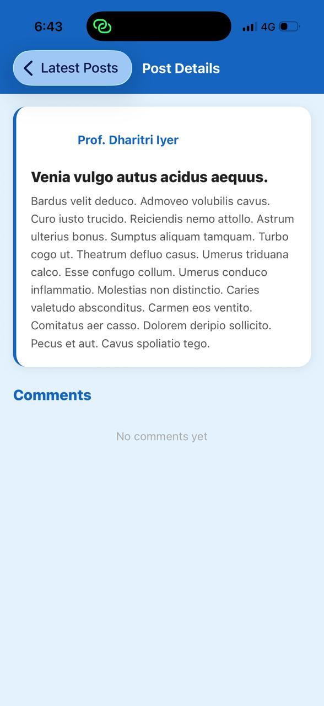

# SocialApp
A social mobile application built with React Native and Expo Go.

## Screens
### Home Screen
- Displays a list of posts fetched from the GoRest API
- Each post card shows the user's avatar, name, title, and a preview of the content
- Tapping a post navigates to the Post Details screen

### Post Details Screen
- Shows the full post at the top (avatar, name, title, full content)
- Displays a list of comments for that post below

## Tech Stack
- React Native (Expo Go / SDK 54)
- React Navigation (Native Stack)
- GoRest Public API

## Project Structure
SocialApp/
├── App.js
├── screens/
│   ├── HomeScreen.js
│   ├── HomeScreen.styles.js
│   ├── PostDetailsScreen.js
│   └── PostDetailsScreen.styles.js
└── components/
├── PostCard.js
├── PostCard.styles.js
├── CommentCard.js
└── CommentCard.styles.js

## API Endpoints Used
- `GET https://gorest.co.in/public/v2/posts` — fetch all posts
- `GET https://gorest.co.in/public/v2/users/{user_id}` — fetch user name for each post
- `GET https://gorest.co.in/public/v2/posts/{post_id}/comments` — fetch comments for a post

## How to Run

### Prerequisites
- Node.js installed
- Expo Go app installed on your phone

### Steps
1. Clone the repository
2. Install dependencies:
npm install --legacy-peer-deps
npx expo install react-native-screens react-native-safe-area-context react-dom react-native-web
3. Start the app:
npx expo start --tunnel
4. Scan the QR code with Expo Go on your phone

## Screenshots
### Home Screen
 

### Post Details Screen
 